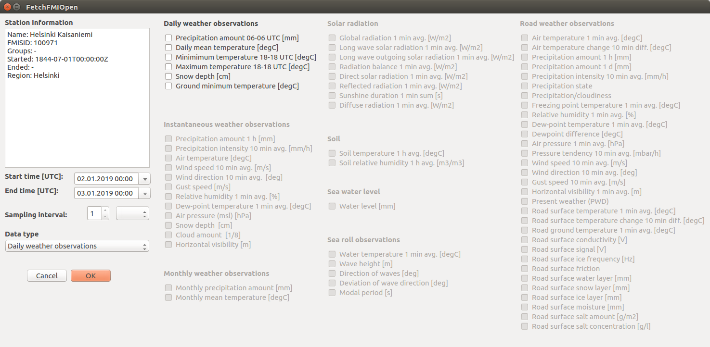

# opendatafmi
A QGIS plugin to download meteorological data from the FMI open data archive

- Contributors: Teemu Kokkonen & [Tero Niemi](http://www.github.com/tjniemi/), Aalto University School of Engineering
- License: GNU GPL

### Overview
This [QGIS](http://www.qgis.org/en/site/) plugin provides a tool to download meteorological data from the [Finnish 
Meteorological Institute] (http://en.ilmatieteenlaitos.fi/) (FMI) [open data archive](https://en.ilmatieteenlaitos.fi/open-data).

### Instructions 
1. Extract the contents of OpenDataFMI.zip to QGIS plugin folder. The default location of QGIS plugin folder on Linux, Mac and Windows are: 
  * \~/.qgis2/python/plugins/                   (Linux, Mac)
  * C:\Users\USERNAME\\.qgis2\python\plugin\\   (Windows)
2. Extract the contents of fmi_stations.zip
3. In QGIS, enable the OpenDataFMI plugin 
4. Add the fmi_stations.shp to a project
5. Select a single feature (station) from the fmi_stations.shp and using the OpenDataFMI plugin download the meteorological 
data from the station.

### Hints
- QGIS can show e.g. OpenStreetMap or Google Map layers through the [OpenLayers Plugin](http://hub.qgis.org/projects/openlayers/wiki) which can put the FMI measurement stations on a map (Web -> OpenLayers plugin -> OpenStreetMap)
- E.g. National Land Survey of Finland (Maanmittauslaitos) has opened maps and other spatial datasets that can help locating the FMI measurement stations ([https://www.avoindata.fi/data/en/dataset](https://www.avoindata.fi/data/en/dataset))

